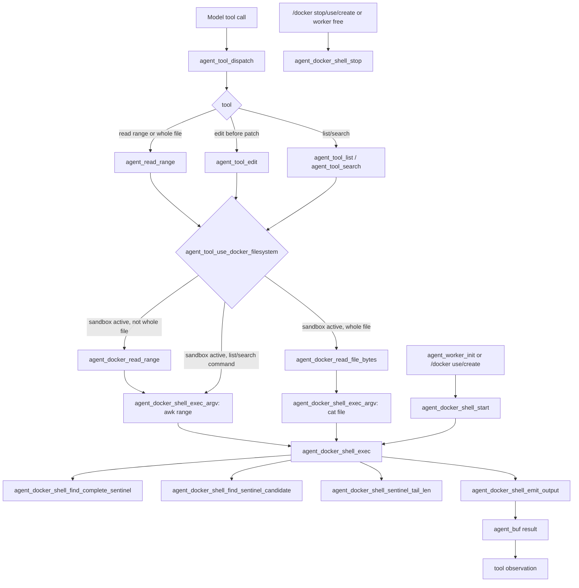
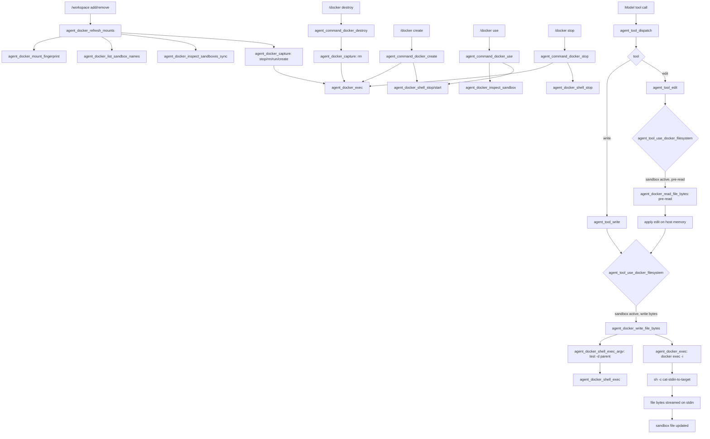

# ds4_agent Docker Call Graph

This note maps the Docker-specific helpers in `ds4_agent.c` for agent coding.
There are two execution styles:

- Persistent shell: one worker-owned `docker exec -i <container> /bin/sh` used by
  read-like filesystem commands. Commands are delimited with sentinel lines.
- Direct exec: a one-shot Docker CLI process used for stdin-streaming writes,
  bash jobs, and sandbox management commands.

## Reading From Docker

Read variants:

- Ranged `read`: `agent_docker_read_range()` runs `awk` in the persistent shell
  so only the requested line window crosses back to the host.
- Whole-file `read` and edit pre-read: `agent_docker_read_file_bytes()` runs
  `cat` with unbounded capture so large files are not capped by the normal tool
  output buffer.
- `list` and `search`: use the same persistent shell execution layer so broad
  filesystem scans stay in the container.

## Writing To Docker

Write variants:

- File write: `agent_docker_write_file_bytes()` first validates the parent
  directory through the persistent shell, then switches to direct `docker exec`
  for the actual byte stream. This avoids interpolating file contents into a
  shell command and keeps large stdin/stdout traffic from deadlocking.
- Edit write: `agent_tool_edit()` reads the current sandbox file, computes the
  replacement in host memory, then writes through the same byte-streaming path.
- Mount and sandbox state writes: `/workspace` changes rebuild labeled sandbox
  containers through `agent_docker_refresh_mounts()`, while `/docker create`,
  `/docker use`, `/docker stop`, and `/docker destroy` use direct Docker CLI
  helpers and reset the persistent shell when the active container changes.
